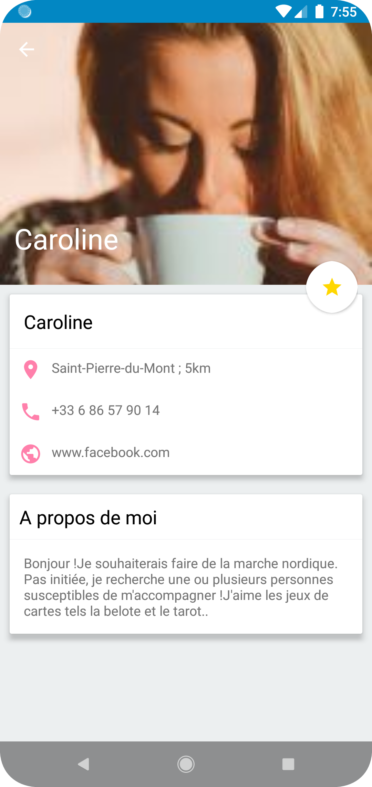

# EntreVoisins

## About
This is my third project for Openclassrooms' Android App Development program.
This App "Entrevoisins" is meant to connect neighbours for better cross-neighbourhood communication and coordination.

## Installation
Clone/Download this repository and open with **Android Studio**
```bash
git clone https://github.com/SimoJOUDAR/P3_Entrevoisins.git
```

## Generating signed APK
From Android Studio:
1. Go to ***Build*** menu
2. Go to ***Build Bundle(s) / APK(s)***
3. Click on ***Build APK(s)***

You can load the apk on an Android phone or AVD to execute it


## Preview
  

